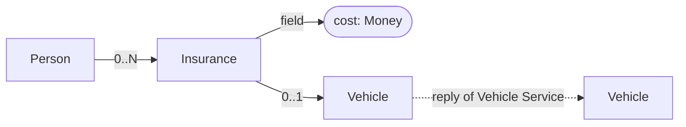

# 7. Implement Insurance Service

Date: 2025-05-30

## Status

Accepted

## Context

**Endpoint:** Accepts a personal identification number and returns all the insurances the person has, along with their
monthly costs.
- If the person has a car insurance, the car information should be included in the response.
- This means Insurance Service should integrate with Vehicle Service.

**Insurance products and prices:**

- Pet insurance: $10
- Personal health insurance: $20
- Car insurance: $30

## Decision

1. Implement Insurance Service

- Use Spring Boot
- Use Springdoc for OpenAPI 3.0
- Use Swagger UI to visualize OpenAPI contract
- Use swagger annotations to define rest api contract details, descriptions, examples, etc.
- follow the same pattern as in Vehicle Service implemented from ADR0001 - ADR0006

2. Integrate Insurance Service with Vehicle Service:

- Use OpenAPI generator tool for converting API definitions to Client code
- Use WebClient (non-blocking HTTP client) for calling Vehicle Service introduced by `spring-boot-starter-webflux`
- Use RestTemplate for unit tests only
- create a BASH script that will generate API definitions from OpenAPI spec and update Vehicle Service client code:
  `./bin/generate.vehicle-service.client.sh`:
    - run vehicle service on local env (be sure that it is running on port 50080)
    - download definition from `http://localhost:50080/v3/api-docs`
    - generate client code using OpenAPI generator tool
    - copy generated client code from temporary folder to
      `services/insurance/src/main/java/com/sample/insurance/clients/vehicle` (patch files if needed)

3. Mock Data at this stage. Later we will use Postgres for storing data.
4. Dockerize the Insurance Service
5. Compose docker-compose.yml to run Insurance Service and Vehicle Service in the same docker-compose environment

- enable healthchecks inside docker-compose.yml

6. Store Money value as a pair of `amount` and `currency` fields.

- Amount should be a integer value (for performance reasons), example: `100` for 1.00 SEK.
- Currency should be a string value, example: `SEK` for Swedish
  Krona. [ISO 4217](https://en.wikipedia.org/wiki/ISO_4217)

7. Used abstractions: Insurance, Money, Person, Vehicle



```bash
# build Insurance Service
./gradlew services:insurance:build
```

8. Utilize WebFlux for reactive programming


```bash
# run both services at the same time
foreman start

# verify Insurance Service healthcheck PING/PONG
http http://localhost:50081/insurances/ping

# verify Insurance Service with test user data
http http://localhost:50081/insurances/person/920328-4428

# to open Swagger UI
open http://localhost:50081/swagger-ui/index.html

# to get OpenAPI contract in JSON
http http://localhost:50081/v3/api-docs

# verify Insurance Service healthcheck
http http://localhost:50081/actuator/health
```

### API Usage example

```java
// Import classes:

import com.sample.insurance.clients.vehicle.ApiClient;
import com.sample.insurance.clients.vehicle.ApiException;
import com.sample.insurance.clients.vehicle.Configuration;
import com.sample.insurance.clients.vehicle.models.*;
import com.sample.insurance.clients.vehicle.api.VehicleApi;

public class Example {
    public static void main(String[] args) {
        ApiClient defaultClient = Configuration.getDefaultApiClient();
        defaultClient.setBasePath("http://localhost:50080");

        VehicleApi apiInstance = new VehicleApi(defaultClient);
        String registrationNumber = "registrationNumber_example"; // String | 
        try {
            Vehicle result = apiInstance.getVehicle(registrationNumber);
            System.out.println(result);
        } catch (ApiException e) {
            System.err.println("Exception when calling VehicleApi#getVehicle");
            System.err.println("Status code: " + e.getCode());
            System.err.println("Reason: " + e.getResponseBody());
            System.err.println("Response headers: " + e.getResponseHeaders());
            e.printStackTrace();
        }
    }
}
```

## Consequences

- Introduce a test user with identification number `920328-4428` (fake user).

```text
Name:	Maria Haglund
Street:	Skirö götsboda
Postal address:	541 54 SKOVDE
Phone:	0500-2546863
Email:	maria.haglund@spamherelots.com
Age:	33 years
Date of birth:	1992-03-28
Social security number :	920328-4428
IP address:	81.234.11.253
PIN code:	7813
Password:	nrggLse3
Shoe size:	43
```

## References

- https://fejk.se/
- https://www.personnummer.nu/
- https://www.baeldung.com/spring-webflux
- https://spring.io/guides/gs/reactive-rest-service
- https://www.reactive-streams.org/