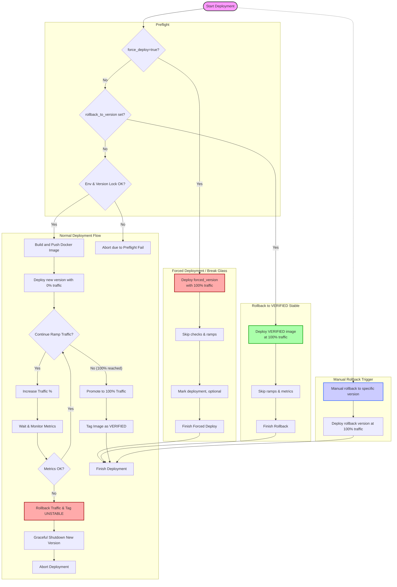

# 11. Green And Blue Deployment Strategy

Date: 2025-06-01

## Status

Accepted

## Context

After we enable all core features it is time to establish the deployment process. 
The strategy is to use Green/Blue deployment strategy.

Core features:
- observability (metrics, logs, traces)
- feature toggles (globally available feature toggles)
- version control

Major principles of the Deployment process/strategy:
- We need multiple environments for deployment, minimalist: staging and production.
  - Can be also established special environment for different purposes: performance, sandbox, etc.
- All deployment based on creating release binaries that follow SEMVER standard. Possible artifacts:
  - JAR files, Source Code, Documentation, Unit Tests Reports, etc
  - Docker Images
  - Git tags
- We use Github actions to perform the deployment process (or any other CI/CD tool).
- We should support scenarious:
  - Normal automatic deployment, triggered by Pull Request merge to main branch
  - Scheduled deployment, triggered by CRON job (deploy specific version in the low-load time)
  - Manual deployment, triggered by developer:
    - Deploy specific version of the application;
    - Rollback to a specific version of the application;
    - Forced deployment of a specific version;
  - Lock and UnLock the deployment to a specific environments
  - Re-deploy (or Restart the application, re-trigger migrations and etc)
- Deployment based on assumption that we host our microservice on cloud, having multiple instances of the same application with load balancer in front of them.
- Deployment based on docker images (containers deployment);

Sub-case: Green/Blue deployment can be implemented inside the microservice.
- deployed new and old implementations at the same time in code, behind feature flag.
- feature flag controls which implementation to use.
- Gradually increase traffic percentage to the new version.
- Monitor metrics, logs or traces to validate the correctness of the new version.
- If metrics are not met, gradually decrease traffic percentage to the new version.
- If metrics are met, mark the new version as verified and switch 100% traffic to the new version.

## Decisions

### Draft of Major workflow

### Sequence of Deployment Steps

1. **Preflight Checks** (Redis-based)
   - Verify if deployment is allowed in the **target environment** (e.g., staging, performance), else abort.
   - Check if there is a **version upgrade lock**; block deployment if requested version is higher than locked version.

2. **Build and Push Docker Image**
   - Use Gradle KTS build.
   - Build versioned Docker image.
   - Push image to GitHub Container Registry.

3. **Deploy New Version with 0% Traffic**
   - Deploy new microservice instances alongside existing ones.
   - Set feature flag `GREEN_BLUE_DEPLOYMENT` to 0% rollout in Redis — no traffic to new version.

4. **Gradual Traffic Ramp-up**
   - Incrementally increase traffic percentage to the new version (e.g., 5%, 10%, 25%, ..., 100%) by updating Togglz gradual feature flag.
   - Load balancer should listen to the Togglz/Redis flag value.
   - After each increment, wait for monitoring period.

5. **Metrics Monitoring and Evaluation**
   - Collect Spring Boot Actuator HTTP metrics (success rate, failure rate, latency) from new instances.
   - Compare against thresholds: e.g., ≥99% success, latency < 200ms, failure < 1%.
   - If metrics meet criteria, proceed; otherwise, trigger rollback.

6. **Automatic Rollback (if needed)**
   - Lower traffic percentage.
   - Gracefully shutdown new version instances.
   - Tag Docker image as `UNSTABLE`.

7. **Mark Deployment Verified**
   - Upon reaching 100% traffic with passing metrics (for the first instance), tag Docker image as `VERIFIED`.

8. **Repeat Deployment Cycle**
   - Deploy new versions similarly, replacing old versions gradually.

9. **Manual Rollback**
   - Support manual rollback to a specific version via GitHub Actions workflow dispatch.
   - Set traffic to 100% for rollback version.

## Consequences

This strategy provides:

- **Controlled deployments** to selective environments only.
- **Safe version upgrades** with version locking.
- **Zero downtime deployments** via Blue/Green with traffic shifting controlled by Togglz feature flags.
- **Automated health validation** by checking real-time metrics with rollback on failures.
- **Image tagging** for verified vs unstable states to track deployment quality.
- **Manual rollback** ability integrated into CI/CD workflow.

## Possible Issues

1. Redis and Togglz are custom solutions, most clouds provide their own solutions for this.

## References:

- https://medium.com/@krishkrishnakumar93/blue-green-deployment-for-web-app-using-nginx-with-multiple-instances-0e3218995794
- https://dev.to/justincy/blue-green-node-js-deploys-with-nginx-bkc
- https://medium.com/@ands0927/blue-green-deployment-1257d295be06 - switch between springboot profiles blue, green, switch NGINX upstream
- https://docs.byteplus.com/en/docs/vke/Implementing-canary-and-blue-green-deployments-using-an-Nginx-Ingress
- https://megamorf.gitlab.io/2021/04/22/nginx-blue-green-deployment-workflow/
- https://www.geeksforgeeks.org/blue-green-deployments-with-docker/
- https://github.com/ianlewis/kubernetes-bluegreen-deployment-tutorial

---

[Prev](./0010-feature-toggle-integration.md) | [Next](./0012-)