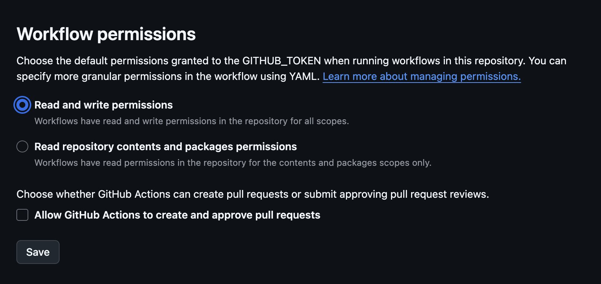

# 14. Github Action CI and CD

Date: 2025-06-02

## Status

Accepted

## Context

Demonstrate the CI/CD pipeline using Github Actions.

## Decision

Minimalistic pipeline that publish docker images.

## Consequences

the Docker images will be assigned the following tags after publishing:

- Branch name tag: Since the workflow runs on pushes to the main branch, images will be tagged with main (e.g., ghcr.io/username/repo/services/vehicle:main)
- Semantic version tag: When you push a git tag that starts with "v" (like v1.2.3), the image will be tagged with the corresponding semantic version (e.g., ghcr.io/username/repo/services/vehicle:1.2.3)
- Short commit SHA tag: Each image will be tagged with the short SHA of the git commit (e.g., ghcr.io/username/repo/services/vehicle:a1b2c3d)
- Latest tag: The image will also always be tagged with latest (e.g., ghcr.io/username/repo/services/vehicle:latest)

- Enable publishing for Github actions in The Github Project Settings (Actions -> General -> Workflow permissions -> Set "Read and write permissions").

---

[Prev](./0013-test-containers-setup.md) | [Next]()